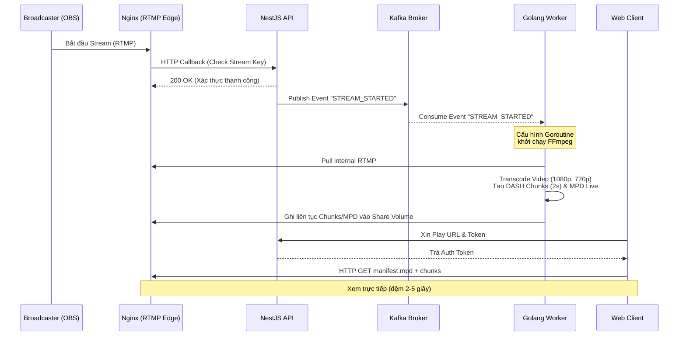
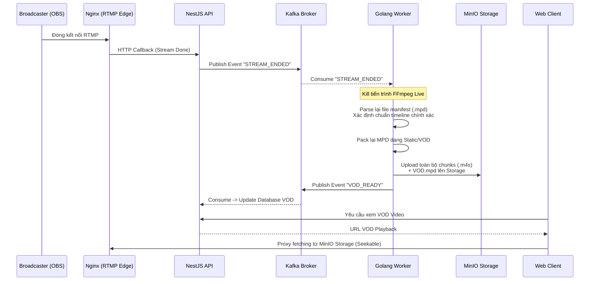

<div align="center">
  

# 🎥 High-Performance Live Streaming & VOD Platform

_Một hệ thống Streaming hoàn chỉnh hỗ trợ Live Streaming độ trễ thấp và Video On Demand (VOD) với kiến trúc Microservices._

  <p>
    
    
    
    
    
    
  </p>
</div>

---

## 📖 Giới thiệu

Hệ thống Streaming này được thiết kế dựa trên kiến trúc phân tán (Microservices) tối ưu hiệu suất, cung cấp khả năng **Live Streaming** trực tiếp và giải pháp xem lại **VOD (Video On Demand)**. Mục tiêu cốt lõi của hệ thống là đem lại trải nghiệm xem không độ trễ, mượt mà không bị chuẩn hướng (stalls), khả năng tua (seek) chính xác và giao diện chuyên nghiệp như Theater mode.

## ✨ Tính năng nổi bật

- 📡 **Ingest & Distribution**: Nginx đóng vai trò Media Edge, nhận luồng RTMP nguyên bản và phân phối định dạng DASH siêu tốc thông qua hệ thống Lua Caching nội tại.
- ⚙️ **Video Processing Worker**: Trái tim xử lý luồng viết bằng **Golang**. Tự động điều khiển FFmpeg để transcode (Multi-bitrate), đóng gói Chunk (segment 2 giây) hiệu năng cao.
- 🎬 **VOD Seekable Replay**: Chuyển đổi mượt mà các luồng Live đã kết thúc thành định dạng VOD chuẩn. Khôi phục và tái thiết lập (parsing) file manifest (`.mpd`), cho phép người dùng tua (seeking) chính xác đến từng frame thời gian.
- 🧑‍💻 **Modern Client Player**: SPA xây dựng với Next.js và DASH.js player. Fetching token an toàn, đồng thời mang đến giao diện xem phong phú.
- 🛠️ **Event-Driven Architecture**: Tích hợp luồng điều phối trạng thái trung tâm thông qua **Apache Kafka**. Decouple tối đa các services.
- 🐳 **Docker Containerized**: Triển khai dễ dàng một chạm với hệ sinh thái Docker Compose.

---

## 🏗️ Kiến trúc Hệ thống & Luồng Xử Lý (Workflows)

Hệ thống sử dụng **Kafka** làm thông điệp tủy sống, cho phép NestJS API, Nginx Edge và Golang Worker giao tiếp dị bộ và mở rộng dễ dàng.

Dưới đây là chi tiết cụ thể cho luồng truyền phát:

### 1. Luồng Live Streaming (Đã hoàn thiện)

Quy trình phát trực tiếp tối ưu hóa độ trễ thông qua quá trình đẩy luồng, chuyển tách chunk và phân mảnh nội dung tới viewer:



**Cách hoạt động**:

- **Ingest**: OBS đẩy RTMP vào Nginx. Nginx kích hoạt webhook sang NestAPI để xác minh tính hợp lệ của User.
- **Message Broker**: Nếu luồng hợp lệ, NestAPI cập nhật Database và bắn event `STREAM_STARTED` qua **Kafka**.
- **Media Transcoder**: Golang Worker (chạy nền) lắng nghe Kafka, spawn một tiến trình độc lập kéo luồng RTMP từ Nginx, sử dụng FFmpeg cắt nhỏ luồng thành dạng .m4s (2 giây) cùng với một Live MPD động.
- **Distribution**: Cả ngàn người đang theo dõi sẽ fetch tệp DASH thông qua cổng Nginx Edge với cơ chế cache trên RAM.

---

### 2. Luồng VOD Seekable (Đã hoàn thiện)

Video On Demand cho trích xuất xem lại mượt mà, hỗ trợ khả năng "tua" tự do. Đây là bước khi Livestream kết thúc:



**Cách hoạt động**:

- **Bắt Event Dừng**: Khi máy Streamer mất mạng hoặc tự tắt, Nginx báo `Done` cho API. Event `STREAM_ENDED` ngay lập tức có trên Kafka.
- **Tái Cấu Trúc Manifest**: Golang Worker ngắt Livestream, nhưng nó sẽ thu thập toàn bộ các file tạm. Nó tự parse file MPD cuối cùng, tính toán lại BaseURL và gỡ thẻ định dạng `dynamic`. Điều này cho phép Client sau này có thể biết chính xác thời lượng và byte-range khi ấn tua.
- **Cold Storage Sync**: Golang Worker chuyển hàng ngàn chunk đã cắt đẩy an toàn sang **MinIO Storage** (S3).
- **Phân phối**: Giờ đây, VOD có thể được Request bằng HTTP bình thường. Nginx đứng làm Reverse-Proxy đứng trước MinIO để phân phối lại cho frontend có cache hỗ trợ.

---

## 💻 Công nghệ sử dụng

| Lớp                | Công nghệ                             | Vai trò                                                                |
| :----------------- | :------------------------------------ | :--------------------------------------------------------------------- |
| **Frontend**       | React, Next.js, DASH.js, Tailwind CSS | Giao diện người dùng, Tích hợp Player, Quản lý trạng thái xem.         |
| **Backend API**    | Node.js, NestJS, TypeScript           | Cung cấp Rest API, xác thực, quản lý quyền và metadata của Stream/VOD. |
| **Event Broker**   | **Kafka**, Zookeeper                  | Quản lý luồng sự kiện phân tán, decouple trạng thái dịch vụ.           |
| **Media Worker**   | Golang, FFmpeg, Goroutines            | Transcoding video song song, cắt segment, xử lý sự kiện streaming.     |
| **Media Server**   | Nginx, Nginx-RTMP module              | Nhận luồng RTMP, phân phối dạng DASH/HLS với kiến trúc Lua Caching.    |
| **Lưu Trữ & Khác** | Docker, MinIO, Redis, PostgreSQL      | Môi trường hệ thống, Cold Storage (S3), Database & Cache Session.      |

---

## 📂 Tổ chức Thư mục

```text
System-streaming/
├── client/                 # Mã nguồn Frontend (Next.js, UI Components, Page flow)
├── server/                 # Nhóm mã nguồn Backend & Infrastructure
│   ├── nest/               # NestJS Core API Application
│   ├── golang-worker/      # Golang service: Nhận Event Kafka & Xử lý FFmpeg
│   ├── nginx/              # Cấu hình Nginx (Nginx.conf, RTMP hooks, Lua Security)
│   ├── storage/            # Disk storage volume mô phỏng
│   └── docker-compose.yml  # Docker Compose config tổng orchestrating 8 services
└── README.md               # Hệ thống tài liệu
```

---

## 🚀 Hướng dẫn Cài đặt & Khởi chạy (Local Development)

### Yêu cầu hệ thống

- **Node.js** (v18+)
- **Yarn** / **npm**
- **Go** (1.20+)
- **Docker** & **Docker Compose**
- Máy chạy mượt mà để handle transcode FFmpeg (Khuyến khích >= 16GB RAM)

### Cài đặt nhanh

**1. Khởi động tầng Infrastructure & Backend (Bằng Docker)**

```bash
cd server
docker-compose up -d --build
```

_Lệnh này sẽ tự động tải tự khởi động toàn bộ hạ tầng gồm: Zookeeper, Kafka, Redis, PostgreSQL, MinIO, Nginx Edge, NestJS API và Golang Media Worker._

**2. Khởi chạy Client Frontend**

```bash
cd client
yarn install
# Copy file env mẫu nếu có
cp .env.local.example .env.local
yarn dev
```

Truy cập ứng dụng ngay tại trình duyệt: `http://localhost:3000`
